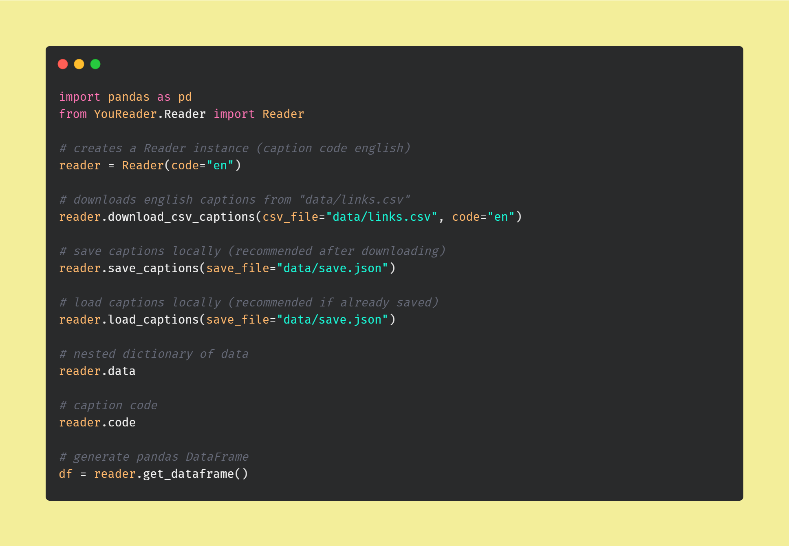

<a name="overview"/>

Guess The Class
===============
A CS105 Project that classifies and characterizes class lectures based on word frequency.<br>
Project developed by Shreya Balaji, Benson Wan, and Richard Duong.<br>
[Link to the Github Repository Here](https://github.com/richard-duong/GuessTheClass)<br>
If you want to take a look at our presentation and findings, [click here](https://docs.google.com/presentation/d/1wCLjnrUXo_stpBl8lypJbDmQXZoYwnrlkxQ2zqIGqe4/edit?usp=sharing)<br>


------------------------------
<a name="table-of-contents"/>


Table Of Contents
=================
1. [Overview](#overview)<br>
2. [Table Of Contents](#table-of-contents)<br>
3. [How to use](#how-to-use)
4. [References](#references)<br>
<br><br>


<h3>Additional Documents</h3>

1. [Project Presentation](https://docs.google.com/presentation/d/1wCLjnrUXo_stpBl8lypJbDmQXZoYwnrlkxQ2zqIGqe4/edit?usp=sharing)<br>
2. [Project Report](docs/report.pdf)<br>
3. [Timeline](docs/timeline.md)<br>
4. [Assignment Specifications](docs/specs.pdf)<br>
5. [Project Proposal](docs/proposal.pdf)<br>


-----------
<a name="how-to-use"/>

How to use
==========
This repository contains sample data extracted from YouTube. The directory structure is as follows:
```
YouReader/                  # custom python package for extracting captions
docs/                       # documents, graphics, and other resources
notebooks/                  # notebooks for graphics
scripts/                    # setup scripts
tests/                      # unit and integration tests
old/                        # old development code
data/                       # collected data
          links.csv         # input file for links
          example.csv       # example input file
          save.json         # downloaded and cleaned data
```
<br>

### Steps (Prerequisites)
Before you can use and test code from this project, you will need the following installed on your system:
* [Python 3.7](https://www.python.org/downloads/)
* [pip - The Python Package Installer](https://pip.pypa.io/en/stable/installing/)
<br>

Optional if you want to generate graphics with notebooks
* [Anaconda](https://www.anaconda.com/products/individual) or [Jupyter Notebook](https://jupyter.org/install.html)
<br>

### Steps (First Time Installation)
To use this package, you'll have to generate a virtual environment to download the prerequisite python libraries.
If you have not generated the virtual environment yet, follow these steps.
1. Download and extract the code
2. Run the following commands:

```
Move to project directory
=========================
$ cd GuessTheClass

To generate a virtual environment
=================================
[Linux, MacOS]
$ chmod +x scripts/setup.sh
$ scripts/setup.sh

[Git Bash on Windows]
$ scripts/winsetup.sh

[Cmd Prompt on Windows]
> "scripts/setup.bat"

```
<br>

### Steps (General Setup)
After setting up the virtual environment for the first time,
Run these commands to load up the virtual environment before you start using our package.

```
Load the virtual environment
============================
[Linux, MacOS]
$ source env/bin/activate

[Git Bash on Windows]
$ source env/Scripts/activate

[Cmd Prompt on Windows]
> "env/Scripts/activate.bat" 


Disable the virtual environment
===============================
$ deactivate
```
<br>

### How to run
If you want to run our program and use the existing dataset,
you can use the template notebook in the notebook/ directory

```
GuessTheclass/notebooks/template.ipynb
```
<br>


If you have your own existing dataset that you want to test:
1. Put your YouTube links into "data/links.csv"
2. You can build your captions dataset using the example below

<p align="center">
          
</p>
<br>


-----------------------
<a name="references"/>

* [Data Pre-processing and Dimensionality Reduction Techniques](https://www.ijert.org/research/text-data-pre-processing-and-dimensionality-reduction-techniques-for-document-clustering-IJERTV1IS5278.pdf)
* [Bag of Words Vector Model](https://en.wikipedia.org/wiki/Bag-of-words_model)
* [TF-IDF Vector Model](https://en.wikipedia.org/wiki/Tf%E2%80%93idf)
* [Stemming/Lemmatization](https://en.wikipedia.org/wiki/Stemming)
* [Porter Stemmer vs. Snowball Stemmer vs. Lancaster Stemmer](https://towardsdatascience.com/stemming-lemmatization-what-ba782b7c0bd8)
* [Stemming Support to sklearn Vectorizer](https://stackoverflow.com/questions/36182502/add-stemming-support-to-countvectorizer-sklearn)
* [K Nearest Neighbors](https://en.wikipedia.org/wiki/K-nearest_neighbors_algorithm)

